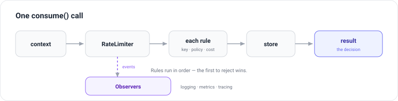
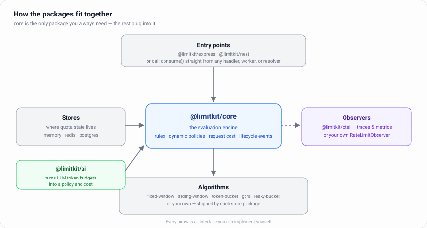

# LimitKit

**Declarative rate limiting for Node.js.**

Most rate limiters give you primitives. LimitKit gives you a system — define your rules in one place, pass context, get a decision.

## Table of Contents

- [Why LimitKit?](#why-limitkit)
- [Installation](#installation)
- [Quick Example](#quick-example)
- [How it works](#how-it-works)
- [Core Concepts](#core-concepts)
- [Policies](#policies)
- [Real-World Example](#real-world-example)
- [Packages](#packages)
- [Common Recipes](#common-recipes)
- [AI / LLM rate limiting](#ai--llm-rate-limiting)
- [Extending LimitKit](#extending-limitkit)
- [Comparisons](#comparisons)
- [Contributing](#contributing)
- [License](#license)

---

## Why LimitKit?

Rate limiting grows messy as your app grows. Here's what that looks like:

```ts
app.use(async (req, res, next) => {
  try {
    await globalLimiter.consume('global');
    await ipLimiter.consume('ip:' + req.ip);

    if (req.user) {
      if (req.user.plan === 'pro') {
        await proLimiter.consume('acc:' + req.user.id);
      } else {
        await freeLimiter.consume('acc:' + req.user.id);
      }

      if (req.path.includes('export')) {
        if (req.user.plan === 'pro') {
          await exportLimiter.consume('acc:' + req.user.id, 1);
        } else {
          await exportLimiter.consume('acc:' + req.user.id, 10);
        }
      }
    }
  } catch {
    return res.status(429).json({ message: 'Too many requests' });
  }
  next();
});
```

Every new rule means another limiter instance, another conditional, another place to keep in sync.

LimitKit replaces this with a schema of rules and a single `consume` call:

```ts
const limiter = new RateLimiter({
  store,
  rules: [
    {
      name: 'global',
      key: 'global',
      policy: fixedWindow({ window: 1, limit: 1000 }),
    },
    {
      name: 'ip',
      key: (req) => 'ip:' + req.ip,
      policy: fixedWindow({ window: 1, limit: 500 }),
    },
    {
      name: 'user-plan',
      key: (req) => 'acc:' + req.user.id,
      policy: (req) =>
        req.user.plan === 'pro'
          ? slidingWindow({ window: 60, limit: 1000 })
          : slidingWindow({ window: 60, limit: 100 }),
    },
    {
      name: 'costly',
      key: (req) => 'acc:' + req.user.id,
      cost: (req) =>
        req.path.includes('export') ? (req.user.plan === 'pro' ? 1 : 10) : 1,
      policy: tokenBucket({ capacity: 100, refillRate: 5 }),
    },
  ],
});
```

```ts
app.use(async (req, res, next) => {
  const result = await limiter.consume(req);
  if (!result.allowed)
    return res.status(429).json({ message: 'Too many requests' });
  next();
});
```

All rules in one place. No nested conditionals. Adding a rule doesn't touch existing ones.

---

## Installation

```bash
npm install @limitkit/core @limitkit/memory
```

See [Packages](#packages) for all available packages.

---

## Quick Example

```ts
import { RateLimiter } from '@limitkit/core';
import { slidingWindow, InMemoryStore } from '@limitkit/memory';

const limiter = new RateLimiter({
  store: new InMemoryStore(),
  rules: [
    {
      name: 'global',
      key: 'global',
      policy: slidingWindow({ window: 10, limit: 1000 }),
    },
    {
      name: 'per-ip',
      key: (ctx) => 'ip:' + ctx.ip,
      cost: (ctx) => (ctx.isPriority ? 5 : 1),
      policy: slidingWindow({ window: 60, limit: 60 }),
    },
  ],
});

const result = await limiter.consume({ ip: '127.0.0.1', isPriority: false });

if (!result.allowed) {
  console.log(
    `Blocked by "${result.failedRule}". Retry after ${result.rules[0].availableAt}`,
  );
}
```

> Prefix keys with a namespace (`ip:`, `acc:`) to avoid collisions between rules targeting the same identifier.

---

## How it works

<p align="center">
  
</p>

You hand `consume()` a context object. The limiter walks its rules in order, and for each one it works out _who_ to limit (the key), _how_ to limit them (the policy), and _how much_ this request costs, then checks the store. The first rule to reject ends the walk — the rules after it are never touched. What comes back tells you whether the request is allowed, which rule stopped it, and where every rule that ran now stands.

A key, a policy, or a cost can each be a plain value or a function, sync or async. So a rule can look a user's plan up mid-evaluation and choose its limit from that.

---

## Core Concepts

A rule has four fields:

```ts
{ name, key, policy, cost? }
```

| Field    | Type                              | Description                                                                                   |
| -------- | --------------------------------- | --------------------------------------------------------------------------------------------- |
| `name`   | `string`                          | Unique identifier. Appears in `result.failedRule` when this rule is exceeded.                 |
| `key`    | `string \| (ctx) => string`       | Who to limit — IP, user ID, a global constant, anything. Can be async.                        |
| `policy` | `Algorithm \| (ctx) => Algorithm` | Which algorithm to apply. Can be dynamic (e.g., different limits per plan).                   |
| `cost`   | `number \| (ctx) => number`       | Weight per request (default: `1`). Use for operations that should consume more than one unit. |

---

## Policies

Algorithms are imported from the store package (`@limitkit/memory` or `@limitkit/redis`), not from `@limitkit/core`. The algorithm and the store must come from the same package.

| Algorithm              | Signature                                    | Best for                                                          |
| ---------------------- | -------------------------------------------- | ----------------------------------------------------------------- |
| Fixed Window           | `fixedWindow({ window, limit })`             | Simplest option. Fast, O(1) state. Allows boundary bursts.        |
| Sliding Window         | `slidingWindow({ window, limit })`           | Accurate per-request tracking. No boundary bursts.                |
| Sliding Window Counter | `slidingWindowCounter({ window, limit })`    | Approximation of sliding window with lower memory overhead.       |
| Token Bucket           | `tokenBucket({ capacity, refillRate })`      | Smooth limiting that tolerates short bursts.                      |
| Leaky Bucket           | `leakyBucket({ capacity, leakRate })`        | Drops requests above the leak rate. Inverse of token bucket.      |
| Leaky Bucket (shaping) | `shapingLeakyBucket({ capacity, leakRate })` | Delays instead of dropping. Returns `availableAt` for scheduling. |
| GCRA                   | `gcra({ burst, interval })`                  | Precise, low-memory rate limiting derived from telecom standards. |

### Traffic shaping

`shapingLeakyBucket` never rejects — it tells you _when_ a request can safely run. Use it for job queues to absorb backpressure without dropping work:

```ts
const result = await limiter.consume(ctx);
setTimeout(() => handleJob(), result.rules[0].availableAt - Date.now());
```

---

## Real-World Example

Public and authenticated routes have different contexts — `req.user` is undefined on public routes. Rather than handle both in one limiter with conditionals, split into two rule sets and compose:

```ts
const globalRules = [
  {
    name: 'global',
    key: 'global',
    policy: fixedWindow({ window: 1, limit: 1000 }),
  },
  {
    name: 'ip',
    key: (req) => 'ip:' + req.ip,
    policy: fixedWindow({ window: 5, limit: 500 }),
  },
];

const authenticatedRules = [
  {
    name: 'user',
    key: (req) => 'acc:' + req.user.id,
    policy: slidingWindow({ window: 60, limit: 100 }),
  },
  {
    name: 'costly',
    key: (req) => 'acc:' + req.user.id,
    cost: (req) => (req.path.includes('export') ? 10 : 1),
    policy: tokenBucket({ refillRate: 5, capacity: 100 }),
  },
  {
    name: 'plan',
    key: (req) => 'acc:' + req.user.id,
    policy: (req) =>
      req.user.plan === 'pro'
        ? gcra({ burst: 1000, interval: 30 })
        : gcra({ burst: 100, interval: 60 }),
  },
];

const publicLimiter = new RateLimiter({ store, rules: globalRules });
const authedLimiter = new RateLimiter({
  store,
  rules: [...globalRules, ...authenticatedRules],
});
```

`globalRules` is reused without duplication. Each limiter is a transparent description of exactly what applies.

---

## Packages

<p align="center">
  
</p>

`@limitkit/core` is the engine. Everything else is optional and connects through an interface core defines — the store, the algorithms, the framework adapter, the observers. You can replace any one of them without touching the rest.

| Package                                                      | Role                                   | Status                |
| ------------------------------------------------------------ | -------------------------------------- | --------------------- |
| [`@limitkit/core`](./packages/core/README.md)                | Orchestration engine                   | Required              |
| [`@limitkit/redis`](./packages/stores/redis/README.md)       | Redis-backed atomic policies           | Production            |
| [`@limitkit/postgres`](./packages/stores/postgres/README.md) | Postgres-backed durable policies       | Production            |
| [`@limitkit/memory`](./packages/stores/memory/README.md)     | In-memory policies                     | Development / testing |
| [`@limitkit/express`](./packages/adapters/express/README.md) | Express middleware                     | Optional              |
| [`@limitkit/nest`](./packages/adapters/nest/README.md)       | NestJS guard and decorators            | Optional              |
| [`@limitkit/ai`](./packages/integrations/ai/README.md)       | LLM token budgets and usage extraction | Optional              |

---

## Common Recipes

### Login protection

Rate limit by IP to block brute-force attempts:

```ts
{ name: "login", key: (req) => "ip:" + req.ip, policy: slidingWindow({ window: 60, limit: 5 }) }
```

### Expensive endpoints

Charge more tokens for compute-heavy routes:

```ts
{
  name: "costly",
  key: (req) => "acc:" + req.user.id,
  cost: (req) => req.path === "/generate" ? 10 : 1,
  policy: tokenBucket({ refillRate: 5, capacity: 1000 }),
}
```

### SaaS plan-based limits

Apply different policies per subscription tier:

```ts
{
  name: "plan",
  key: (ctx) => "acc:" + ctx.user.id,
  policy: (ctx) => ctx.user.plan === "pro"
    ? gcra({ burst: 1000, interval: 30 })
    : gcra({ burst: 100, interval: 60 }),
}
```

---

## AI / LLM rate limiting

A request is a poor unit for an LLM API: one call can cost a hundred tokens or a hundred thousand, and a frontier model's tokens can cost twenty times a small model's. [`@limitkit/ai`](./packages/integrations/ai/README.md) budgets by what a call actually costs.

It reads token counts out of a provider response and turns a budget into the token-bucket policy that expresses it. It depends only on `@limitkit/core` — responses are read structurally, so no provider SDK is needed.

```ts
import { RateLimiter } from '@limitkit/core';
import { InMemoryStore, tokenBucket } from '@limitkit/memory';
import { extractOpenAIUsage, monthlyTokenBudget } from '@limitkit/ai';

const limiter = new RateLimiter({
  store: new InMemoryStore(),
  rules: [
    {
      name: 'monthly-tokens',
      key: (ctx) => 'acc:' + ctx.userId,
      cost: (ctx) => ctx.tokens,
      policy: tokenBucket(monthlyTokenBudget({ tokens: 1_000_000 })),
    },
  ],
});

const completion = await openai.chat.completions.create({ ... });
const usage = extractOpenAIUsage(completion);

const result = await limiter.consume({ userId, tokens: usage.totalTokens });
```

`monthlyTokenBudget`, `weeklyTokenBudget`, and `sessionTokenBudget` exist because a token bucket's `refillRate` is **tokens per second**, and converting a budget by hand is easy to get wrong: 1M tokens a month is `0.386` tokens/second. Miss that by five orders of magnitude and you get a limiter that looks configured but never limits.

### Reading usage from any provider

`extractOpenAIUsage`, `extractAnthropicUsage`, `extractOllamaUsage`, and `extractHuggingFaceUsage` all return the same shape, so one rule works across providers:

```ts
{
  (inputTokens, outputTokens, totalTokens, cachedInputTokens);
}
```

This is not cosmetic. OpenAI counts cached prompt tokens inside `prompt_tokens`; Anthropic's `input_tokens` **excludes** them. Charging the raw field from both silently undercounts every cached Anthropic call.

### Weighting by model

One budget can govern a whole model lineup — spend it on many cheap calls or a few expensive ones:

```ts
cost: modelWeightedCost({
  weights: { 'gpt-4o': 10, 'gpt-4o-mini': 1 },
  defaultWeight: 10, // fail closed on a model you haven't priced
  model: (ctx) => ctx.model,
  tokens: (ctx) => ctx.usage.totalTokens,
});
```

### A budget can only refuse the next call, not this one

Token counts don't exist until the model has answered, so charging afterwards can't refuse the call that overran — it can only refuse the next one. [`examples/llm-gateway`](./examples/llm-gateway) is a working gateway built on that reality, layering a per-IP limit and a per-plan burst limit (which run before the call and can refuse it outright) with a per-user token budget (which can't). A reserve/commit API that would let the budget check close that gap is proposed in [issue #27](https://github.com/alphatrann/limitkit/issues/27).

---

## Extending LimitKit

Most of LimitKit is an interface with a default implementation behind it. When a default doesn't fit, you implement the interface — no forks, no monkey-patching.

### A custom algorithm

An algorithm is a small class: hold a config, validate it, and compute the next state from the previous one. Here is a "cooldown" — one request passes, then a fixed quiet period before the next:

```ts
import type { Algorithm, RateLimitRuleResult } from '@limitkit/core';
import type { InMemoryCompatible } from '@limitkit/memory';

interface CooldownConfig {
  name: 'cooldown';
  seconds: number;
}

class Cooldown
  implements Algorithm<CooldownConfig>, InMemoryCompatible<{ until: number }>
{
  constructor(readonly config: CooldownConfig) {}

  validate() {
    if (this.config.seconds <= 0) throw new Error('seconds must be > 0');
  }

  process(state: { until: number } | undefined, now: number) {
    const until = state?.until ?? 0;
    const allowed = now >= until;
    const next = allowed ? now + this.config.seconds * 1000 : until;
    return {
      state: { until: next },
      output: {
        allowed,
        limit: 1,
        remaining: 0,
        resetAt: next,
        availableAt: allowed ? undefined : until,
      } satisfies RateLimitRuleResult,
    };
  }
}

const cooldown = (seconds: number) =>
  new Cooldown({ name: 'cooldown', seconds });
```

It then drops into a rule like any built-in policy:

```ts
{ name: 'contact-form', key: (ctx) => 'ip:' + ctx.ip, policy: cooldown(30) }
```

`process()` is the in-memory contract. A Redis or Postgres algorithm implements that store's contract instead — usually a Lua script or a SQL statement, so the read-modify-write stays atomic under concurrency.

### A custom observer

An observer is told what happens as `consume()` runs. Implement only the handlers you need. A handler that throws is caught and passed to `onObserverError`, so it can never break the rate-limit decision. This is the same interface [`@limitkit/otel`](./packages/integrations/observability/README.md) is built on.

```ts
import { RateLimiter } from '@limitkit/core';
import type { RateLimitObserver, LimitEventMap } from '@limitkit/core';

class RejectionAlerter implements RateLimitObserver {
  onConsumeReject({ event, result }: LimitEventMap['consume.reject']) {
    fetch(process.env.SLACK_WEBHOOK!, {
      method: 'POST',
      body: JSON.stringify({
        text: `rate limit hit: ${result.failedRule} (request ${event.id})`,
      }),
    }).catch(() => {});
  }
}

const limiter = new RateLimiter({
  store,
  rules,
  observers: [new RejectionAlerter()],
});
```

See [`examples/observability`](./examples/observability) for a running service that wires an observer to OpenTelemetry.

---

## Comparisons

[`express-rate-limit`](https://github.com/express-rate-limit/express-rate-limit) is the right choice for simple, Express-specific rate limiting — one global or per-IP limit as middleware, minimal setup.

[`rate-limiter-flexible`](https://github.com/animir/node-rate-limiter-flexible) covers more storage backends and is solid for imperative use — you instantiate a limiter per strategy and call each one manually.

LimitKit is for when you outgrow the imperative model: multiple overlapping rules, dynamic policies per context, weighted request costs, and plan-based limits. The difference is whether you're writing middleware logic or declaring a rule set.

---

## Contributing

Contributions are welcome. Read [`CONTRIBUTING.md`](./CONTRIBUTING.md) for development guidelines.

---

## License

MIT
