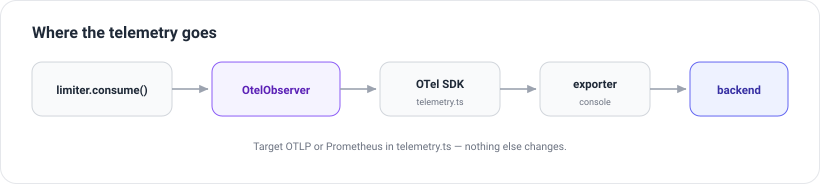

# Observability example

A small Express service, rate limited with LimitKit, with every `consume()` call
reported to OpenTelemetry through [`@limitkit/otel`](../../packages/integrations/observability).

It prints the spans and metrics straight to the console, so you can run it and
watch the telemetry with no collector, no Prometheus, and nothing to install
beyond the workspace itself.

## Run it

From the repo root:

```bash
yarn install
yarn build
yarn workspace @limitkit/example-observability start
```

Then send it some traffic:

```bash
curl -s -X POST localhost:3000/api/echo \
  -H 'content-type: application/json' \
  -H 'x-api-key: demo' \
  -d '{"hello": "world"}'
```

The console prints a trace for that request within a second or so, and the
metrics a few seconds later when the reader next flushes. Copy
[`.env.example`](./.env.example) to `.env` if you want to change the port, the
service name, or that flush interval.

## How it's put together

<p align="center">
  
</p>

Two files do the work, and only one of them mentions OpenTelemetry:

- **[`src/telemetry.ts`](./src/telemetry.ts)** builds a small OTel pipeline and
  registers it as the process-wide tracer and meter. It runs first, before
  anything else reads the environment or builds the observer.
- **[`src/limiter.ts`](./src/limiter.ts)** hands `new OtelObserver(...)` to the
  `RateLimiter`. That one line is the whole integration. The observer finds the
  providers `telemetry.ts` registered and never touches an exporter itself.

Everything backend-specific lives in `telemetry.ts`. Pointing this at a real
collector (below) doesn't touch `limiter.ts` at all.

## The rules

Both are in [`src/limiter.ts`](./src/limiter.ts):

- **`per-ip`** — a fixed window of 60 requests per minute, keyed by caller IP.
- **`per-key-burst`** — a token bucket that lets 10 requests through at once and
  refills 2 per second, keyed by the `x-api-key` header. Callers with no key
  share one `anonymous` bucket.

Whichever rule rejects names itself in the 429 response, and every response
carries `x-ratelimit-*` headers taken from the rule with the least room left.

## What you'll see

Each request produces a `limitkit.consume` span with one `limitkit.rule` child
span per rule, so a trace shows exactly which rule ran, what it decided, and how
much quota was left. Alongside that come three metrics — a request counter, a
`consume()` duration histogram, and a remaining-quota histogram — each tagged by
rule and outcome. The [`@limitkit/otel` README](../../packages/integrations/observability/README.md)
lists every span attribute and metric in full.

The rate-limit key here is a raw IP or API key, which is both personal and
high-cardinality, so `limiter.ts` passes a `hashKey` that records only a short
SHA-256 prefix. Leave `hashKey` off to keep the key out of traces entirely (the
default), or set `includeKey: true` when you control the key space.

## Watching it limit

Fire requests at one key faster than its bucket refills and the extras are
rejected:

```bash
for i in $(seq 15); do
  curl -s -o /dev/null -w "req $i -> %{http_code}\n" -X POST localhost:3000/api/echo \
    -H 'content-type: application/json' -H 'x-api-key: burst-test' -d '{}'
done
# req 12 -> 200
# req 13 -> 429   (failedRule: per-key-burst)
# req 14 -> 429
```

The exact request that trips depends on timing — the bucket holds 10 and refills
2 per second, so a slower loop gets a few more through first. Each rejection
shows up as a `limitkit.rule` span with `limitkit.allowed` false and bumps the
request counter with `outcome="reject"`.

## Pointing it at a real backend

The console exporters are only for the demo. Swap them in
[`src/telemetry.ts`](./src/telemetry.ts) for exporters that match your stack —
the rest of the file, and all of `limiter.ts`, stays as it is.

For a collector, Tempo, Jaeger, Datadog, or Honeycomb, add the OTLP exporters
and hand them to the same provider setup:

```bash
yarn workspace @limitkit/example-observability add \
  @opentelemetry/exporter-trace-otlp-http @opentelemetry/exporter-metrics-otlp-http
```

```ts
import { OTLPTraceExporter } from '@opentelemetry/exporter-trace-otlp-http';
import { OTLPMetricExporter } from '@opentelemetry/exporter-metrics-otlp-http';

const spanProcessors = [new SimpleSpanProcessor(new OTLPTraceExporter())];
const reader = new PeriodicExportingMetricReader({
  exporter: new OTLPMetricExporter(),
});
```

`OTEL_EXPORTER_OTLP_ENDPOINT` then points both at your collector.

For Prometheus and Grafana, use the Prometheus exporter as the metric reader:

```bash
yarn workspace @limitkit/example-observability add @opentelemetry/exporter-prometheus
```

```ts
import { PrometheusExporter } from '@opentelemetry/exporter-prometheus';

const reader = new PrometheusExporter({ port: 9464 }); // scraped at :9464/metrics
```

`@limitkit/otel` ships a `grafana-dashboard.json` — allow, reject, and error
rates, `consume()` latency percentiles, and remaining quota per rule. Import it
in Grafana and pick your Prometheus source.

One caveat carried over from the demo: it uses `InMemoryStore`, so limits reset
when the process does and aren't shared between instances. Moving to
`@limitkit/redis` or `@limitkit/postgres` changes neither the rules nor the
observer wiring.
